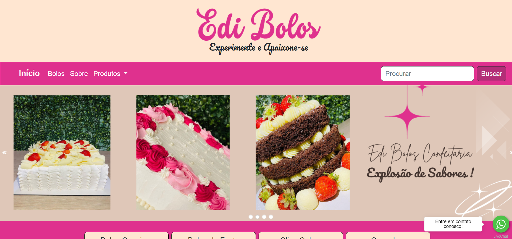

<H1> align="center">Projeto de Desenvolvimento Web - Edi Bolos</H1>
 

</a>

<H3>Descrição do Projeto:</H3>
 

O objetivo deste projeto foi desenvolver um site dinâmico onde o cliente possa divulgar e vender seus produtos. O site permite que o cliente, sem a necessidade de codificação, adicione, edite ou exclua produtos facilmente.
\n

<b>Projeto Integrador do curso Técnico em Informática, na área de Desenvolvimento de Sistemas.</b>

<H3>Integrantes:</H3>
<ul>
<li><a href="">Eduardo(Eu)</a></li>
<li><a href="https://github.com/GuilhermeHSV">Guilherme</a></li>
<li><a href="https://github.com/GustavoSantos69">Gustavo</a></li>
<li><a href="https://github.com/LucasFelippe011">Lucas</a></li>
<li><a href="https://github.com/kaelton01">Caelton</a></li>
</ul>

<H3>Minha Contribuição:</H3>
 

Fui responsável principalmente pela implementação do Back-end e do Banco de Dados, mas participei em todas as fases do projeto.

<H4>Tecnologias Utilizadas:</H4>

<H5>Front-End:</H5>
<ul>
<li>HTML</li>
<li>CSS</li>
<li>JavaScript</li>
</ul>

<H5>Back-End:</H5>
<ul>
<li>PHP</li>
<li>MySQL</li>
</ul>

<H5>Bibliotecas, Frameworks e APIs:</H5>
<ul>
<li>Jivochat</li>
<li>Bootstrap</li>
<li>jQuery</li>
<li>PWA (Progressive Web Apps)</li>
</ul>

<H5>IDE's:</H5>
<ul>
<li>VSCode</li>
<li>Adobe Dreamweaver</li>
</ul>

<H6>Metodologia Ágil:</H6>
<ul>
<li>Scrum</li>
</ul>
